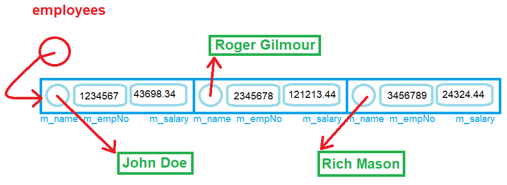

# Workshop #2: Dynamic Memory

- *Version 1.0*


In this workshop, you will use *references* to modify content of variables in other scopes, overload functions and allocate memory at run-time and deallocate that memory when it is no longer required. 


## Learning Outcomes

Upon successful completion of this workshop, you will have demonstrated the abilities to:

- allocate and deallocate dynamic memory for an array;
- overload functions;
- create and use references;


## Submission Policy

This workshop is divided into two coding parts and one non-coding part:

- Part 1: A step-by-step guided workshop, worth 50% of the workshop's total mark that is due on **Thursday at 23:59:59** of the week of your scheduled lab.
> Please note that the part 1 section is **not to be started in your first session of the week**. You should start it on your own before the day of your OOP244 class and join the first session of the week to ask for help and correct your mistakes (if there are any).
- Part 2 (**DIY**): A Do It Yourself type of workshop that is much more open-ended and is worth 50% of the workshop's total mark. This part is due on **Sunday at 23:59:59** of the week of your scheduled lab.  
- *reflection*: non-coding part, to be submitted together with *DIY* part. The reflection doesn't have marks associated with it but can incur a **penalty of max 40% of the whole workshop's mark** if your professor deems it insufficient (you make your marks from the code, but you can lose some on the reflection).
- Submissions of part 2 that do not contain the *reflection* (that is the **non-coding part**) are not considered valid submissions and are ignored.


If at the deadline the workshop is not complete, there is an extension of **one day** when you can submit the missing parts.  **The code parts that are submitted late receive 0%.**  After this extra day, the submission closes; if the workshop is incomplete when the submission closes (missing at least one of the coding or non-coding parts), **the mark for the entire workshop is 0%**.

Every file that you submit must contain (as a comment) at the top:<br />
**your name**, **your Seneca email**, **Seneca Student ID** and the **date** when you completed the work.

If the file contains only your work or work provided to you by your professor, add the following message as a comment at the top of the file:

> I have done all the coding by myself and only copied the code that my professor provided to complete my workshops and assignments.


If the file contains work that is not yours (you found it online or somebody provided it to you), **write exactly which part of the assignment is given to you as help, who gave it to you, or which source you received it from.**  By doing this you will only lose the mark for the parts you got help for, and the person helping you will be clear of any wrongdoing.

## Compiling and Testing Your Program

All your code should be compiled using this command on `matrix`:

```bash
g++ -Wall -std=c++11 -g -o ws file1.cpp file2.cpp ...
```

- `-Wall`: the compiler will report all warnings
- `-std=c++11`: the code will be compiled using the C++11 standard
- `-g`: the executable file will contain debugging symbols, allowing *valgrind* to create better reports
- `-o ws`: the compiled application will be named `ws`

After compiling and testing your code, run your program as following to check for possible memory leaks (assuming your executable name is `ws`):

```bash
valgrind ws
```

To check the output, use a program that can compare text files.  Search online for such a program for your platform, or use *diff* available on `matrix`.

> Note: All the code written in workshops and the project must be implemented in the **sdds** namespace.

# PART 1 (50%) Employees Salary Report

***Employees Salary Report*** is a program that reads an unknown number of Employee records from a file and holds these records of Employees in a dynamically allocated array of **Employee**s. (Each record holds the Employee's name, Employee number and Salary of the Employees in a comma separated value format.)

After loading all the information into a dynamic array of **Employee**s, the program will sort the records based on the Employee number of the Employee in an ascending order and prints them on the screen.

## PART 1 Execution example

```text
Employee Salary report, sorted by employee number
no- Empno, Name, Salary
------------------------------------------------
1- 117493: Bumblebee Man, 43554.1
2- 238023: Alice Glick, 15310.6
3- 261382: Artie Ziff, 44801.1
4- 268411: Bernice Hibbert, 27776.9
5- 463877: Allison Taylor, 93971.9
6- 529967: Abraham Simpson, 80084.4
7- 543817: Barney Gumble, 54858.7
8- 737371: Agnes Skinner, 32943.1
9- 760089: Akira Kurosawa, 55772
10- 811518: Baby Gerald, 90670.1
11- 836915: Apu Nahasapeemapetilon, 63415.7
12- 881837: Bart Simpson, 47608.2
13- 928072: Carl Carlson, 23678.4
14- 954291: Brandine Spuckler, 51499.7
```

This program is partially developed; you can find all the files in the lab directory. Your responsibility is to complete the code as stated in the comments in the source code.

## The Code

The structure holding the Employee record is designed as follows:

```C++
struct Employee {
  char* m_name;
  int m_empNo;
  double m_salary;
};
```

In addition to holding the employee records in an dynamically allocated array of `Employee`s, each employee's name is also held in a dynamically allocated C-style string in the **Employee** structure. Consider the following visual and note that every circle with an arrow in this diagram shows dynamic memory in use.


  

## Data file  

The data in the file has the following format:

```Text
EMPLOYEE NUMBER,SALARY,NAME<NEWLINE>
```

and this is a sample file:

```Text
529967,80084.40,Abraham Simpson
737371,32943.14,Agnes Skinner
760089,55772.04,Akira Kurosawa
238023,15310.58,Alice Glick
463877,93971.86,Allison Taylor
836915,63415.69,Apu Nahasapeemapetilon
261382,44801.13,Artie Ziff
811518,90670.05,Baby Gerald
543817,54858.69,Barney Gumble
881837,47608.23,Bart Simpson
268411,27776.91,Bernice Hibbert
954291,51499.66,Brandine Spuckler
117493,43554.12,Bumblebee Man
928072,23678.38,Carl Carlson
```


### The Modules

There are three modules in the program: `File`, `Employee` and `salReport`.


#### `File` Module

This modules contains functions that facilitate working with files to read data. The module has one global variable called `fptr`. This File pointer is used to point to the datafile for the application.

The following functions are already implemented in the `File` module:

- `openFile`: Opens the data file for reading  
- `closeFile`: Closes the data file
- `noOfRecords`: Returns an integer that is the number of records in the file; use this function in the `Employee` module to determine the size of the dynamic array of employees.


***Your coding responsibility in the `File` module:***

Implement 3 **overloads** of a function called `read`:

1. `read`: accepts as a parameter the **address** of an array of characters. Reads from the file the name of the employee and stores it in the parameter.
    
    Returns `true` if the read was successful, `false` otherwise.

    Use the following `fscanf` function to read the name of the employee from the file and return true if `fscanf` returns 1. See more information [here](https://en.cppreference.com/w/cpp/io/c/fscanf).

    ```C
    fscanf(fptr, "%[^\n]\n"......
    ```

2. `read`: accepts as a parameter a **reference** to an integer representing the employee number. Reads from the file the employee number and stores it in the parameter.

    Returns `true` if the read was successful, `false` otherwise.

    Use the following `fscanf` function to read the number from the file and return true if `fscanf` returns 1. See more information [here](https://en.cppreference.com/w/cpp/io/c/fscanf).

    ```C
    fscanf(fptr, "%d,".......
    ```

3. `read`: accepts as a parameter a **reference** to an floating point number in double precision representing the employee's salary. Reads from the file the employee salary and stores it in the parameter.

    Returns `true` if the read was successful, `false` otherwise.

    Use the following `fscanf` function to read the salary from the file and return true if `fscanf` returns 1. See more information [here](https://en.cppreference.com/w/cpp/io/c/fscanf).

    ```C
    fscanf(fptr, "%lf,",......
    ```


#### `Employee` Module

> **Note**: the Employee module uses the `cstring` module of workshop 1 part 2 (DIY) for the functions `strLen` and `strCpy`.
>
> For those who did not complete these two functions in workshop 1, leave the module empty and use the standard `<cstring>` header file.


The `Employee` module has two global variables:
  ```cpp
  // Holds the number of records (employees) in the file.
  // Should be used (after setting) to allocate the dynamic array of Employees.
  int noOfEmployees;
  
  // Stores the address of a dynamically-allocated array of employees.
  //   The size of the array is "noOfEmployees".
  Employee* employees;
  ```


The function `sort` has been already implemented. This function sorts the array of employees based on the employee number.


***Your coding responsibility in the `Employee` module.***

Implement following functions:

- `load`: receives as parameter a reference to an object of type `Employee`, loads from the file the information about the employee and returns `true` if it was successful (`false` otherwise).

    - First it will read the employee number, then salary and finally in a **local** array of 128 characters, it will read the employee name from the file.

    - If all reads are successful:
        - find the actual length of the employee name using the `strLen` function implemented in `cstring` module of Workshop #1 and then add one to the length (for null termination)
        - allocate the same amount of characters in the name of the `Employee` parameter
        - copy the read name (from the local character array) into the newly allocated name of the `Employee` parameter using `strCpy` function implemented in Workshop #1.
        - store the employee number and salary read into the attributes of the parameter.
        - return `true`.
    - If at least one read failed, do not change the parameter and return `false`.

- `load`: an overload of the `load` function that receives no parameters. This function should:
    - open the file (use function(s) from `File` module)
    - get the number of records (employees) from the file (use function(s) from `File` module) and store it into the global variable
    - create a dynamically allocated array of `Employee`; store its address into the global variable.
    - load each record from the file and store it into the array.
    - if everything is loaded correctly, return `true`.
    - if something goes wrong during data loading, display the following error message and return `false`.
    ```text
    Error: incorrect number of records read; the data is possibly corrupted.
    ```


- `display`: receives as a parameter a constant reference to an Employee object and prints it in the following format:
    ```text
    NUMBER: NAME, SALARY<NEWLINE>
    ```

- `display`: an overload of the `display` function that receives no parameters and returns nothing. This function should:
    - print to screen
    ```txt
    Employee Salary report, sorted by employee number
    no- Empno, Name, Salary
    ------------------------------------------------
    ```
    - sort the array
    - iterate over the sorted array an print each employee in th format:
    ```txt
    IDX- NUMBER: NAME, SALARY<NEWLINE>
    ```
    - see [sample output](#part-1-execution-example) for more details.

- `deallocateMemory`: deallocate **all** the memory used by the the dynamic array of employees (make sure to also deallocate the names).


### `salReport` Module.

This module is already provided. Look at it, make sure you understand it, but do not change it.


### Files to submit:  

```Text
salReport.cpp <--- contains the main function, do not modify this.
File.cpp
File.h
Employee.cpp
Employee.h
cstring.h   // leave empty if not completed in workshop 1
cstring.cpp // leave empty if not completed in workshop 1
```

## PART 1 Submission 

Upload your source code and data file to your `matrix` account. Compile and run your code using the `g++` compiler as shown above and make sure that everything works properly.

Then, run the following command from your account
- replace `profname.proflastname` with your professor’s Seneca userid
- replace **??** with your subject code (2**00** or 2**44**)
- replace **#** with the workshop number
- replace **X** with the workshop part number (**1** or **2**) 
```text
~profname.proflastname/submit 2??/w#/pX
```

and follow the instructions.

> **⚠️Important:** Please note that a successful submission does not guarantee full credit for this workshop. If the professor is not satisfied with your implementation, your professor may ask you to resubmit. Re-submissions will attract a penalty.


# PART 2 - DIY (50%) postal-code-based population report

Write a **postal-code-based population report** program that reads series of records of postal codes and their population in Canada from a comma-separated-values file and prints a report of the postal code and their population sorted in an ascending order based on the population of the account. 

The data file is called `PCpopulations.csv` and is formatted like as follows:
  
```Text
Three First Characters of postal code
comma
population
newline
```

Example:

```Text
A0A,46587
A0B,19792
A0C,12587
A0E,22294
A0G,35266
A0H,17804
A0J,7880
A0K,26058
A0L,7643
A0M,6200
A0N,13815
A0P,13721
A0R,2543
A1A,30382
A1B,19867
```

## DIY Execution example (with the incomplete sample file)
```text
Postal Code: population
-------------------------
1- A0R:  2543
2- A0M:  6200
3- A0L:  7643
4- A0J:  7880
5- A0C:  12587
6- A0P:  13721
7- A0N:  13815
8- A0H:  17804
9- A0B:  19792
10- A1B:  19867
11- A0E:  22294
12- A0K:  26058
13- A1A:  30382
14- A0G:  35266
15- A0A:  46587
-------------------------
Population of Canada: 282439
```

Implement this program in 3 modules called `popReport`, `File` and `Population` that can accomplish the above task.  

***You may freely use/copy any logic or code needed from the PART 1 section!***

Files to submit:  
```Text
popReport.cpp <--- contains the main function, do not modify this.
File.cpp
File.h
Population.cpp
Population.h
cstring.h
cstring.cpp
```

## `File` Module

The `File` module is partially implemented. 


## `Population` Module

The `Population` module is not implemented.

There are three mandatory functions in the `Population` module. Apart from these three functions you are free to choose any method to implement this system, however you must use function overloading, reference and dynamic memory allocation since the number of records in submission will be much more that what you have for development.

Mandatory functions in this module:

- `load`: Loads data from a file, and returns `true` if data was successfully loaded, `false` otherwise. This function receives as a parameter the name of the file
    - If the file cannot be found, print the following error message: 
    ```Text
    Could not open data file: FILENAME<ENDL>
    ```

    - If the file doesn't have a correct content, print:
    ```Text
    Error: incorrect number of records read; the data is possibly corrupted!<ENDL>
    ```

- `display`: a function with no parameters that return nothing and prints the report as shown in [DIY Execution example](#diy-execution-example).

- `deallocateMemory`: a function with no parameters that return nothing and deallocate **all** dynamic memory used by the program.


## Reflection

Study your final solutions for each deliverable of the workshop, reread the related parts of the course notes, and make sure that you have understood the concepts covered by this workshop.  **This should take no less than 30 minutes of your time and the result is suggested to be at least 150 words in length.**

Create a file named `reflect.txt` that contains your detailed description of the topics that you have learned in completing this workshop and mention any issues that caused you difficulty.

In the code above, you were instructed to overload the function `read` multiple times. The parameter received by these overloads is called an **out parameter**. Do some research and explain what is an **out parameter** for a function and compare it with an **in parameter**.  In your code, can you identify any function that receives an **in parameter**? Justify your answer.

You may be asked to talk about your reflection (as a presentation) in class.


## DIY Submission (part 2)

> When submitting, your program will be tested against a data file similar to `PCpopulations.csv`.

> To test and demonstrate the execution of your program use the same data as shown in the [PART 1 Execution example](#part-1-execution-example) .

Upload your source code and data file to your `matrix` account. Compile and run your code using the `g++` compiler as shown above and make sure that everything works properly.

Then, run the following command from your account
- replace `profname.proflastname` with your professor’s Seneca userid
- replace **??** with your subject code (2**00** or 2**44**)
- replace **#** with the workshop number
- replace **X** with the workshop part number (**1** or **2**) 
```text
~profname.proflastname/submit 2??/w#/pX
```

and follow the instructions.

> **⚠️Important:** Please note that a successful submission does not guarantee full credit for this workshop. If the professor is not satisfied with your implementation, your professor may ask you to resubmit. Re-submissions will attract a penalty.
